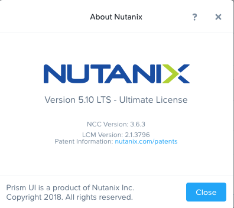

.. _nutanix101:

------------------------
Nutanix 101
------------------------

*The estimated time to complete this lab is 60 minutes.*

Overview
++++++++

New to Nutanix and AHV? This lab is for you!

**In this lab you will explore Prism Element and become familiar with its features and navigation. You will use Prism to perform basic cluster administration tasks, including storage and networking. You will also walk through basic VM deployment and management tasks with Prism and AHV. Finally, you will explore VM data protection, including snapshots and replication.**

Prism Element
+++++++++++++

The Prism service provides the web UI for managing Nutanix clusters and runs on every Controller VM (CVM). This local Prism service, referred to Prism Element, can be accessed via the IP of any individual CVM, or via the virtual IP for the cluster, which will redirect to the current Prism leader.

#. Open \https://<*NUTANIX-CLUSTER-IP*>:9440 in a new browser tab.

#. Log in using the following credentials:

   - **Username** - admin
   - **Password** - *HPOC Password*

   .. figure:: images/nutanix_tech_overview_01.png

#. After you log in to Prism Element, familiarize yourself with the Prism UI. Explore the information on the **Home** screen, as well as the other screens.

#. Review the Home screen, and identify the following items:

   - Hypervisor
   - Version
   - Hardware Model
   - Health
   - VM Summary
   - Warning Alerts
   - Data Resiliency Status

   .. figure:: images/nutanix_tech_overview_02.png

#. Review the UI navigation options.

   .. figure:: images/nutanix_tech_overview_03.png

#. Examine the cluster hardware under **Prism > Hardware**, click **Hardware**, then click **Diagram**.

#. Review the hardware summary information:

   - Blocks
   - Hosts
   - Memory
   - CPU
   - Disks

   .. figure:: images/nutanix_tech_overview_04.png

#. Review the other sections, and do a quick walk through:

   - VM
   - Health
   - Network
   - Data Protection
   - Storage
   - Alerts
   - Etc.

#. Review other sections of the Prism UI

   - Health :fa:`heartbeat`
   - Alarms :fa:`bell`
   - Tasks :fa:`circle-o`
   - Search :fa:`search`
   - Help :fa:`question`
   - Configuration :fa:`cog`
   - User :fa:`user`

   .. figure:: images/nutanix_tech_overview_05.png

Prism Element UI Review
.......................

Where would you locate the version of AOS you are running?

You can do this by clicking on the **User** drop down :fa:`user`, and clicking **About Nutanix**.

How would you get to the following screen to view a summary of the number of hosts (or nodes) and the resource capacity and current utilization?

In **Prism > Hardware**, click **Hardware**, then click **Table**.

How would you get the following screen to see the health of your cluster?

.. figure:: images/nutanix_tech_overview_08.png

In **Prism > Health**, click **Health**, then click **Summary** in the right pane.

What page would show you the latest activity in the system? On this page, you can monitor the progress of any task and keep track of what has been done in the past using time stamps. Can you figure out two different ways to get there?

Browse to **Prism > Tasks** and click **Tasks**, or click the :fa:`circle-o` icon in the toolbar.

Distributed Storage Fabric
++++++++++++++++++++++++++

The Nutanix Distributed Storage Fabric (DSF) appears to the hypervisor like any centralized storage array, but uses the CVMs and local storage in each node to provide shared storage for the cluster - the combination of compute and distributed local storage is what is now commonly referred to as **Hyperconverged Infrastructure (HCI)**.

.. figure:: images/dsf_overview.png

As a pioneer in the HCI space, Nutanix DSF is a mature solution capable of delivering the performance and resiliency needed to support `many different workloads <https://www.nutanix.com/solutions/>`_, including enterprise databases, virtual desktops, ROBO, Big Data, and more.

The two main storage constructs within the DSF are the **Storage Pool** and **Storage Containers**.

The **Storage Pool** is the aggregation of all of the physical disks within a given Nutanix cluster. The cluster manages distribution of data, so configuration of additional storage pools (like LUNs in a traditional storage environment) is **not** required. As new nodes are added to a cluster, disks are automatically added to the pool and the cluster will begin `re-distributing data to the new disks <https://nutanixbible.com/#anchor-book-of-acropolis-disk-balancing>`_ as a background task.

**Storage Containers** are software-defined, logical constructs that allow you to configure storage policy for groups of VMs or vDisks. In the next exercise, you will walk through the process for creating and configuring Nutanix storage within Prism.

.. note::

   To learn more about additional DSF constructs such as vDisks, extents, and extent groups, refer to `this section <https://nutanixbible.com/#anchor-book-of-acropolis-distributed-storage-fabric>`_ of the Nutanix Bible.

Configuring Storage Containers
..............................

#. In **Prism Element> Storage**, click **Storage**, click **Table**, then click **+ Storage Container**.

#. Use the following specifications:

   - **Name** - *Initials*-container
   - Select **Advanced Settings**
   - **Advertised Capacity** - 500 GiB
   - Select **Compression**
   - **Delay (In Minutes)** - 0

#. Click **Save**.

   .. figure:: images/storage_config_01.png

   The storage container will now be available across all nodes within the cluster.

   In AHV, the hypervisor creates a separate iSCSI connection to the DSF for each vDisk in use. In ESXi environments, each **Storage Container** is automatically mounted to the hypervisor as an NFS datastore. Similarly, in Hyper-V, each **Storage Container** is presented as an SMB datastore.

   .. note::

     Example view of **Storage Containers** from Prism:

     .. figure:: images/nutanix_tech_overview_13.png

     Example view of **Storage Containers** (datastores) from vCenter:

     .. figure:: images/nutanix_tech_overview_14.png

   You can create multiple containers with different policies, all sharing capacity from the **Storage Pool**.

   For instance, you may want to enable `deduplication <https://nutanixbible.com/#anchor-book-of-acropolis-elastic-dedupe-engine>`_ for a storage container used for full clone persistent virtual desktops, but deduplication wouldn't make sense for workloads such as databases. Similarly, you may want to create a storage container with `erasure coding <https://nutanixbible.com/#anchor-book-of-acropolis-erasure-coding>`_ enabled for archival data such as backups or security footage.

#. Explore the configuration basics further by updating your Container configuration. How would you ensure capacity availability for critical VMs on a cluster running mixed workloads?

#. Try selecting different storage containers on the cluster and reviewing the **Storage Container Details** below the table.

   .. figure:: images/storage_config_04.png

   This view provides a breakdown of the savings from each available data reduction option as well as the **Effective Usable Capacity** of the container. Hover your mouse over any link for further details. The **Data Reduction Ratio** is the data efficiency when accounting for **only** compression, deduplication, and erasure coding. The **Overall Efficiency** number tracks data reduction as well as native data avoidance in DSF, specifically savings from thin provisioning and cloning.

   .. note::

      Interested in determining how much logical storage Nutanix can provide in different RF2 or RF3 configurations? Check out the `Nutanix Storage Calculator <https://services.nutanix.com/#/storage-capacity-calculator>`_.

Replication Factor (RF)
.......................

The Distributed Storage Fabric uses a Replication Factor (RF) approach to data protection, rather than legacy RAID techniques. By default, writes to Nutanix storage create two copies of the data with the ability to sustain a single node failure - this is called **RF2**. For very large clusters, or critical workloads, Nutanix can write three copies of the data with the ability to sustain two node failures - this is called **RF3**.

Interested in learning about how RF writes and reads work? Check out the video below!

.. raw:: html

   <iframe width="640" height="360" src="https://www.youtube.com/embed/OWhdo81yTpk" frameborder="0" allow="accelerometer; autoplay; encrypted-media; gyroscope; picture-in-picture" allowfullscreen></iframe>

RF policies are applied on a per storage container basis within Prism Element.

Nutanix clusters can also enforce `availability domain policies <https://nutanixbible.com/#anchor-book-of-acropolis-availability-domains>`_ at the Block or Rack level.

Block Awareness, in a sufficiently large cluster, ensures that secondary copies of data are not written to a node within the same physical enclosure as the primary copy. This allows for the loss of a multi-node block without experiencing data unavailability. The same concept can be applied using a Nutanix cluster spanning multiple racks.

The basic requirement for rack/block fault tolerance is to have minimum 3 blocks in the cluster (for RF2) as we need to store 3 copies of metadata. Starting in AOS 5.8, rack and block awareness can be supported with erasure coding enabled.

#. In **Prism > Home**, click **OK** in the **Data Resiliency Status** box.

.. figure:: images/storage_config_03.png

   Data Resiliency Status indicates how many failures can be tolerated without impacting the cluster. Each service listed has a specific function in the cluster. For example, Zookeeper nodes maintain configuration data (service states, IPs, host information, etc.) for the cluster.

#. The RF of a cluster in Prism Element can be configured by clicking **Redundancy State** in the :fa:`cog` menu.

   .. note::

     For this exercise, please leave the redundancy factor configured as 2.

   An RF2 cluster can be upgraded in place to support RF3 (with a minimum of 5 nodes). If a cluster is configured for RF3, 5 copies of metadata will be created for all data, regardless of whether or not the individual storage containers are configured as RF2 or RF3.

Configuring Virtual Networks
++++++++++++++++++++++++++++

AHV leverages Open vSwitch (OVS) for all VM networking. OVS is an open source software switch implemented in the Linux kernel and designed to work in a multiserver virtualization environment. Each AHV server maintains an OVS instance, and all OVS instances combine to form a single logical switch.

Each node is typically uplinked to a physical switch port trunked/tagged to multiple VLANs, which will be exposed as virtual networks.

VM networking is configured through Prism (or optionally CLI/REST), making network management in AHV very simple. In the following exercise you will walk through virtual network creation in AHV. In `Deploying Workloads`_ you will create virtual NICs which will be assigned to your virtual network.

.. note::

   In the following exercise you will create networks using invalid VLANs, meaning no VM traffic will be transmitted outside of an individual host. This is expected as the exercise is for demonstration/education purposes only.

Additional details about AHV networking can be found `here <https://nutanixbible.com/#anchor-book-of-ahv-networking>`_.

Setup User VM Network
.....................

Connect to Prism Element and create a network for user VM interfaces. Use any VLAN other than 0, and do not enable IP address management.

#. In **Prism Element > VM**, click **VMs**, then click **Network Config**.

#. Select **VM Networks**, then click **+ Create Network**.

#. Fill out the following fields and click **Save**:

   - **Name** - *Initials*-Network
   - **VLAN ID** - A value (< 4096) other than your **Primary** or **Secondary** network VLANs
   - Do not select **Enable IP Address Management**

   The final result should look like the image below.

   .. figure:: images/network_config_04.png

   The configured virtual network will now be available across all nodes within the cluster. Virtual networks in AHV behave like Distributed Virtual Switches in ESXi, meaning you do not need to configure the same settings on each individual host within the cluster. When creating VMs in IPAM managed networks, the IP can optionally be manually specified during vNIC creation.

Setup User VM Network with IPAM
...............................

Create another network, but this time enable IPAM.

#. Fill out the following fields and click **Save**:

   - **Name** - *Initials*-Network_IPAM
   - **VLAN ID** - A value (< 4096) other than your **Primary** or **Secondary** network VLANs
   - Select **Enable IP Address Management**
   - **Network IP Address / Prefix Length** - 10.0.0.0/24
   - **Gateway** - 10.0.0.1
   - Do not select **Configure Domain Settings**
   - **Create Pool** - 10.0.0.100-10.0.0.150
   - Do not select **Override DHCP Server**

   .. figure:: images/network_config_03.png

   .. note::

     It is possible to create multiple pool ranges for a network.

   The configured virtual network will now be available across all nodes within the cluster. VMs with vNICs on this network will receive a DHCP address from the range specified. This IP assignment lasts for the life of the VM, avoiding the need to depend on DHCP reservations or static IPs for many workloads.

Deploying Workloads
+++++++++++++++++++

In addition to storage, VM creation, management, and monitoring can all be performed for Nutanix AHV directly through Prism.

.. note::

   Prism also offers native support for VM CRUD operations for Nutanix clusters running ESXi.

In the following exercise we'll walk through creating VMs from source media and from existing disk images.

Creating a Windows VM
.....................

In this exercise you will create a Windows Server VM from a Windows installation ISO image.

AHV provides an **Image Service** feature allows you to build a store of imported files that you can use to create a CD-ROM from an ISO image or an operating system Disk from a disk image when creating a VM. The Image Service supports raw, vhd, vhdx, vmdk, vdi, iso, and qcow2 disk formats.

.. note::

   You can explore the available images and upload additional images under :fa:`cog` **> Image Configuration** in Prism Element.

In order to provide high performance IO to VMs, AHV requires the installation of paravirtualized drivers into the guest (similar to VMware Tools). For Windows guests specifically, these drivers must be loaded during installation in order for the VM's disk to be accessible by the Windows installer.

Nutanix validates and distributes these drivers via http://portal.nutanix.com. The ISO image containing the drivers has already been uploaded to the Image Service.

#. In **Prism Element > VM > Table**, click **+ Create VM**.

#. Fill out the following fields and click **Save**:

   - **Name** - *Initials*-Windows_VM
   - **Description** - (Optional) Description for your VM.
   - **vCPU(s)** - 2
   - **Number of Cores per vCPU** - 1
   - **Memory** - 4 GiB
   - Select :fa:`pencil` next to CDROM
       - **Operation** - Clone from Image Service
       - **Image** - Windows2012R2.ISO
       - Select **Update**
       *This will mount the Windows Server ISO from the Image Service for boot/installation*

   - Select **+ Add New Disk**
       - **Type** - DISK
       - **Operation** - Allocate on Storage Container
       - **Storage Container** - Default Container
       - **Size (GiB)** - 30 GiB
       - Select **Add**
       *This will create a 30GiB vDisk on the selected Storage Container*

   - Select **+ Add New Disk**
       - **Type** - CDROM
       - **Operation** - Clone from Image Service
       - **Image** - Nutanix VirtIO ISO
       - Select **Add**

   - Select **Add New NIC**
       - **VLAN Name** - Primary
       - Select **Add**
       *This will add a single virtual NIC to the VM on the selected Virtual Network*

#. Click **Save** to create the VM.

#. Select the VM, then click **Power On** from the **Actions** drop-down menu to turn on the VM.

#. Select the VM, then click **Launch Console** from the **Actions** drop-down menu to access an HTML5 console to interact with the VM.

#. Progress through the standard install questions until you reach the Windows install location.

   .. note::
     Choose **Datacenter with GUI** and **Custom** installation when presented with the choice.

#. Click **Load Driver** and navigate to the CD where the Nutanix VirtIO is mounted.

#. Browse the CD, and select the directory that corresponds to the Windows OS being installed.

   .. figure:: images/deploy_workloads_05.png

   .. figure:: images/deploy_workloads_06.png

#. Select the three Nutanix drivers displayed (Press and hold the Ctrl key and select all three drivers):

   - Balloon
   - Ethernet adapter
   - SCSI passthrough controller

   .. figure:: images/deploy_workloads_07.png

#. Click **Next**.

   After the drivers are loaded, the disk created in Step 2 appears as an installation target.

#. Select that disk and continue with the normal install process.

#. After the installation completes, the Windows install ISO can be unmounted and the additional CD-ROM used for the drivers can be removed from the VM.

   .. note::

     For ESXi clusters, if a VM is created via VMware vSphere, it appears in the Prism VMs list. Alternatively, if a VM is created via Prism, it appears in the VMware vSphere UI. No manual syncing or waiting is required.

     .. figure:: images/deploy_workloads_08.png

#. Following OS installation you can complete the **Nutanix Guest Tools (NGT)** installtion by selecting the VM in Prism and clicking **Manage Guest Tools > Enable Guest Tools > Mount Guest Tools**.

   This will use the virtual CD-ROM device to mount the NGT installation ISO to the VM. NGT includes the previously installed VirtIO drivers, as well as services to support self-service file restore and application consistent (VSS) snapshots.

#. Return to the VM console to complete the NGT installation.

Creating a Linux VM
...................

In this exercise you will create a CentOS VM from an existing, pre-installed disk image in the Image Service. It is common in many environments to have "template" style images of pre-installed operating systems. Similar to the previous exercise, the disk image has already been uploaded to the Image Service.

#. In **Prism Element > VM > Table**, click **+ Create VM**.

#. Fill out the following fields and click **Save**:

   - **Name** - *Initials*-Linux_VM
   - **Description** - (Optional) Description for your VM.
   - **vCPU(s)** - 1
   - **Number of Cores per vCPU** - 1
   - **Memory** - 2 GiB

   - Select **+ Add New Disk**
      - **Type** - DISK
      - **Operation** - Clone from Image Service
      - **Image** - CentOS7.qcow2
      - Select **Add**
      *This will create a thin clone of the existing CentOS disk image*

   - Select **Add New NIC**
      - **VLAN Name** - Primary
      - Select **Add**

   .. figure:: images/deploy_workloads_03.png

#. Click **Save** to create the VM.

Workload Management
+++++++++++++++++++

Now that you have a couple VMs deployed, let’s have some fun and explore some of the VM management tasks within AHV.

Power Actions and Console Access
................................

Explore VM power actions and console access.

#. In **Prism Element > VM > Table**, use the search bar to locate the Linux VM you created in the previous exercise (*Initials*-**Linux_VM**).

   Note that the Power State column for that VM shows a red dot, indicating that the VM is powered off.

#. Select the VM, then click **Power On**.

#. Select the VM, then click **Launch Console**.

   The console window provides 4 actions: Mount ISO, CTRL-ALT-DEL, Take Screen Capture, and Power.

   .. figure:: images/manage_workloads_01.png

   .. note::

     In ESX:

     - The steps in this exercise could also be done from Prism while using an ESXi cluster that has its VMware vCenter instance registered to Prism.

     .. figure:: images/manage_workloads_06.png

Cloning VMs
...........

#. In **Prism Element > VM > Table**, select your *Initials*-**Linux_VM** VM.

#. Click **Clone** from the **Actions** list.

#. Fill out the following fields and click **Save**:

   - **Number of Clones** - 2
   - **Prefix Name**  - *Initials*-Linux-Clone
   - **Starting Index Number** - 1

   .. figure:: images/manage_workloads_02.png

#. Leave them **Powered Off**.

   Both Nutanix snapshots and clones use a `redirect-on-write <https://nutanixbible.com/#anchor-book-of-acropolis-snapshots-and-clones>`_ algorithm to quickly and efficiently create copies of VMs as a metadata operation.

Migrating a VM Between Hosts
............................

VM live migration is a critical feature for any virtualized environment, allowing VMs to move seamlessly across hosts within a cluster to enable infrastructure maintenance or performance balancing.

#. In **Prism Element > VM > Table**, select your *Initials*-**Linux_VM** VM.

   You should see that it has no entry in the **Host** column when it is powered off.

   .. figure:: images/manage_workloads_03.png

#. Select the **Powered On** VM, then click **Migrate**.

   You can either choose one of the other hosts in the cluster as a migration target for the VM, or accept the default and let AHV automatically select a location.

#. Click **Migrate** to finalize the action.

   When the task completes, verify that your VM host location has changed from the host recorded above to the new location you selected.

   .. figure:: images/manage_workloads_04.png

Configuring Affinity Policies
.............................

#. In **Prism Element > VM > Table**, select your *Initials*-**Linux_VM** VM.

#. Select a **Powered Off** VM, then click **Update** and **+ Set Affinity**.

#. Select two **Hosts** to which the VM can have affinity, and click **Save** and **Save** to finish.

   .. note:: We select more then one host so the VM has a place to migrate too in the event of a Node failure.

#. Power on the VM, and verify it is on one of the **Hosts** you selected in the affinity policy.

#. Select the VM, then click **Migrate**.

   You should see the following message:

   - This VM has host affinity with 2 out of the 4 available hosts. It can only be migrated to those hosts.

#. Click **Migrate**.

   You should see that the VM has moved to the other host.

VM-to-Host affinity rules are commonly used to map VMs to certain hosts for performance or licensing reasons. AHV can also create VM-to-VM anti-affinity rules, commonly used for highly available applications where you need to ensure multiple instances of an application do not run on the same node.

High Availability & Dynamic Scheduling
......................................

Unlike ESXi, high availability is enabled by default for AHV and will restart VMs in a best-effort manner in the event of a host failure. Additional configuration can set resource reservations to ensure there is capacity during an HA event.

.. note::

   To enable memory reservation, select **Enable HA Reservation** under :fa:`cog` **> Manage VM High Availability**.

   As memory is already limited on the shared cluster resources, please do NOT enable HA memory reservations.

With the **Acropolis Dynamic Scheduler** service, AHV performs intelligent initial placement of VMs and can dynamically migrate VMs to other hosts within the cluster to optimize workload performance. This is done "out of the box" without additional configuration.

A benefit of a Nutanix AHV solution is being able to make VM placement decisions not based solely on CPU/memory congestion avoidance, but also based on storage performance.

See `here <https://nutanixbible.com/#anchor-book-of-acropolis-dynamic-scheduler>`_ for additional details about the **Acropolis Dynamic Scheduler**.

Data Protection
+++++++++++++++

Nutanix provides the ability to perform VM/vDisk-level storage snapshots. Protection Domains (PDs) are the construct for grouping VMs and applying snapshot and replication policies.

In this exercise you will use Prism to create and restore from VM snapshots, as well as create a Protection Domain for your VMs.

VM Snapshots
............

#. In **Prism Element > VM > Table**, select your *Initials*-**Linux_VM** VM.

#. If the VM is powered on, perform a **Guest Shutdown** power action.

#. Select the VM and click **Snapshot** from the menu below the table.

#. Provide a name for your snapshot and click **Submit**.

#. Select the **VM Snapshots** tab below the table to view the available snapshots for the selected VM.

   .. figure:: images/manage_workloads_04.png

#. Under **Actions**, click **Details** to see all of the VM’s properties at the time of the snapshot.

   You can see the snapshot contains VM state in addition to just its data.

   *Now it's time to break your VM!*

#. Click **Update** to modify your VM and remove both the CD-ROM and DISK by clicking the **X** icon for each item.

#. Click **Save**.

#. Attempt to power on the VM and launch its console window.

   Note that the VM no longer has any disks from which to boot and that the 2048 game is displayed.

#. Power off the VM.

#. Under **VM Snapshots**, select your snapshot and click **Restore** to revert the VM to a functioning state.

   Alternatively you can click **Clone** to restore to a new VM.

#. Verify that the VM boots successfully.

As previously mentioned, Nutanix snapshots use a `redirect-on-write <https://nutanixbible.com/#anchor-book-of-acropolis-snapshots-and-clones>`_ approach that does not suffer from the performance degradation of chained snapshots found in other hypervisors.

Protection Domains
..................

#. In **Prism Element > Data Protection > Table**, click **+ Protection Domain > Async DR** to begin creating a PD.

   .. note::

      Synchronous replication (Metro Availability) is currently support on ESXi and will be supported in AHV in a future release.

#. Provide a name for the PD, and click **Create**.

#. Filter or scroll to select the VMs created during this lab that you want to add to the PD.

#. Click **Protect Selected Entities** and verify the VMs appear under **Protected Entities**.

   Consistency groups allow you to group multiple VMs to be snapshot at the same time, e.g. multiple VMs belonging to the same application.

   .. note:: Nutanix snapshots can perform application consistent snapshots for supported operating systems with NGT installed. Each VM using application consistent snapshots will be part of its own consistency group.

#. Click **Next**.

#. Click **New Schedule** to define Recovery Point Objective (RPO) and retention.

#. Configure your desired snapshot frequency (e.g. Repeat every 1 hour)

   .. note::

      AHV supports NearSync snapshots, with RPOs as low as 1 minute.

   .. note::

      Multiple schedules can be applied to the same PD, allowing you to take and retain X number of hourly, daily, monthly snapshots.

#. Configure a retention policy (e.g. Keep the last 5 snapshots)

   .. note::

      For environments with remote cluster(s) configured, setting up replication is as easy as defining how many snapshots to keep at each remote site.

      .. figure:: images/snapshot_02.png

#. Click **Create Schedule**.

#. Click **Close** to exit.

That's it! You've successfully configured native data protection in Prism.

Takeaways
+++++++++

What are the key things you should know about **Nutanix AOS, Prism, and AHV**?

- Prism Element is the Nutanix management plane that runs on every node and provides the HTML5 web interface for the cluster.

- Prism Element is thoughtfully laid out, bringing critical information front and center for administrators.

- The Distributed Storage Fabric provides RF2 or RF3 shared storage to the cluster.

- VM-level snapshot and replication policies can be managed through Prism for any supported hypervisor.

- Storage Containers allow you to define storage policy for VMs, including RF level, compression, deduplication, and erasure coding.

- AHV provides native distributed virtual switching and IP address management, simplifying virtual network management.

- AHV VMs can be managed via Prism, CLI, or REST API.

- The AHV Image Service allows you to provide a catalog of available images to be used in VM deployments.

- AHV provides critical features such as live migration, high availability, and dynamic VM placement out-of-the-box without additional configuration.

- Check out `The Nutanix Bible <https://nutanixbible.com>`_ for more information about core Nutanix architecture.
